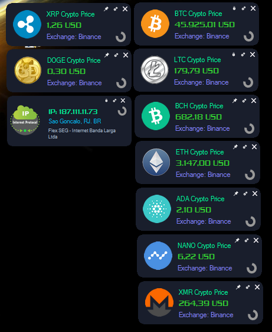

# My Crypto Gadgets.

Gadgets de Criptomoedas ou Criptoativos para Windows, Controle sua monitoração de preços em tempo real.
 Deixarei a Codigo Fonte "Source" para implementação ou modificações. <i>"Você pode implementar mais moedas."</i>
 De brinde Gadgets de IP (Internet Protocol). 

- (BTC) BitCoin
- (LTC) LiteCoin
- (BCH) BitCoin Cash
- (ETH) Ethereum
- (ADA) Cardano
- (NANO) Nano
- (XMR) Monero
- (DOGE) DogeCoin
- ✨Magic ✨

## Características

- Monitoração em Tempo Real
- Suportada Exchange Binance, Bittrex e Bitfinex
- Template Black e White
- Gadget Meu IP (Internet Protocol) (Brinde)
- Fixador em Desktop
- Hide em Sistem Tray (Opcional)
- Inicialização junto ao sitema (Opcional)
 

